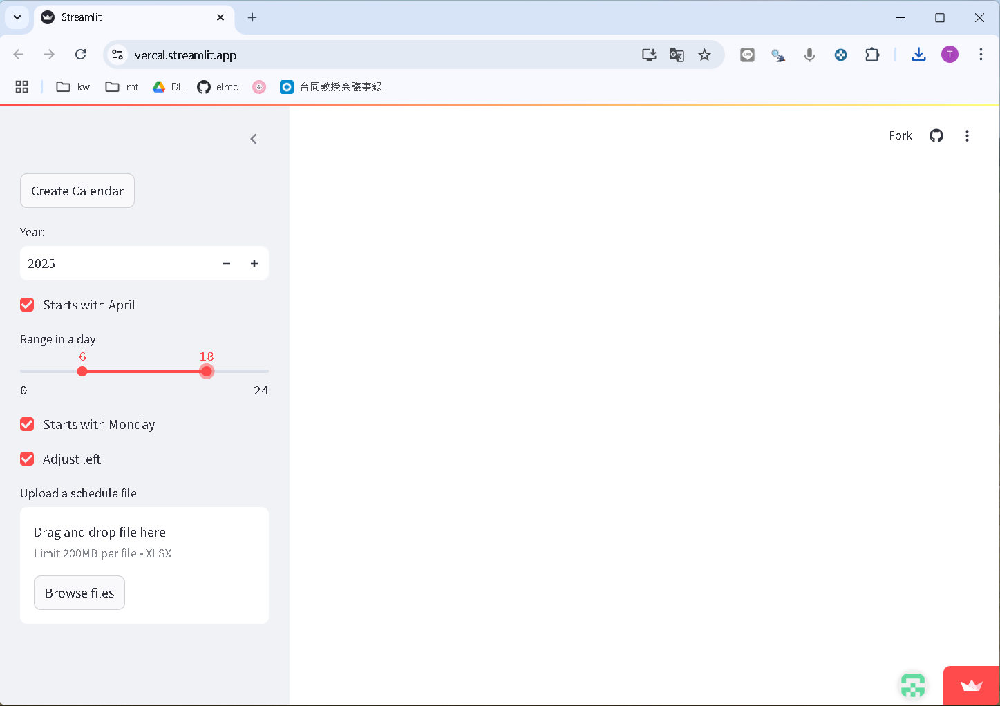
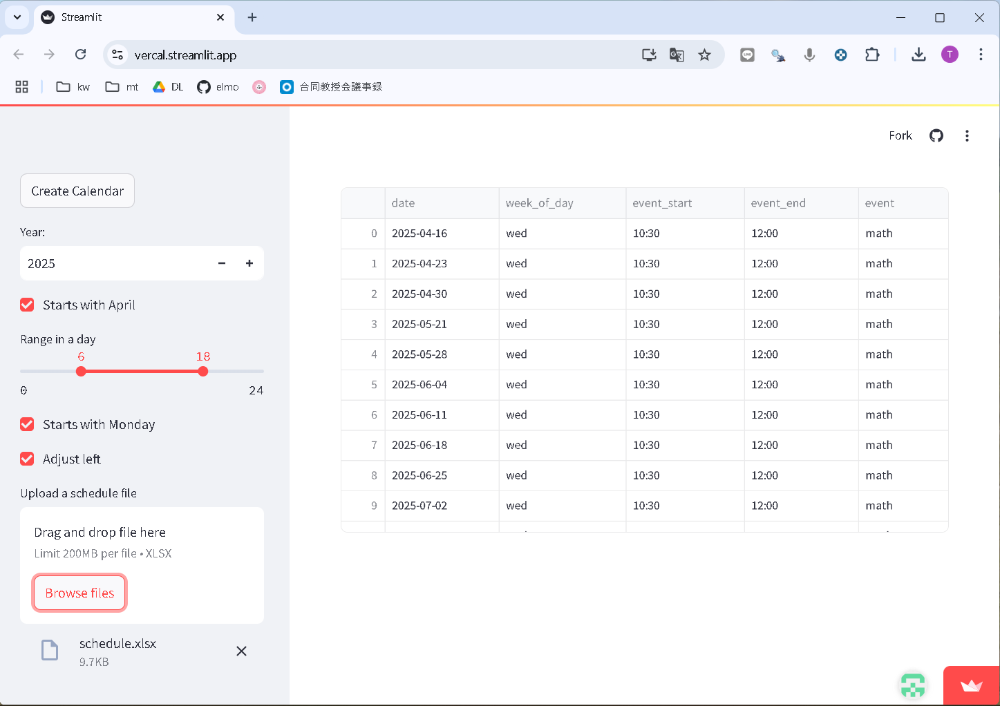
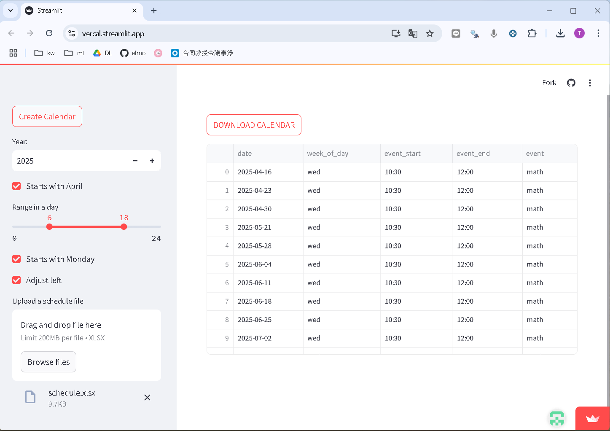
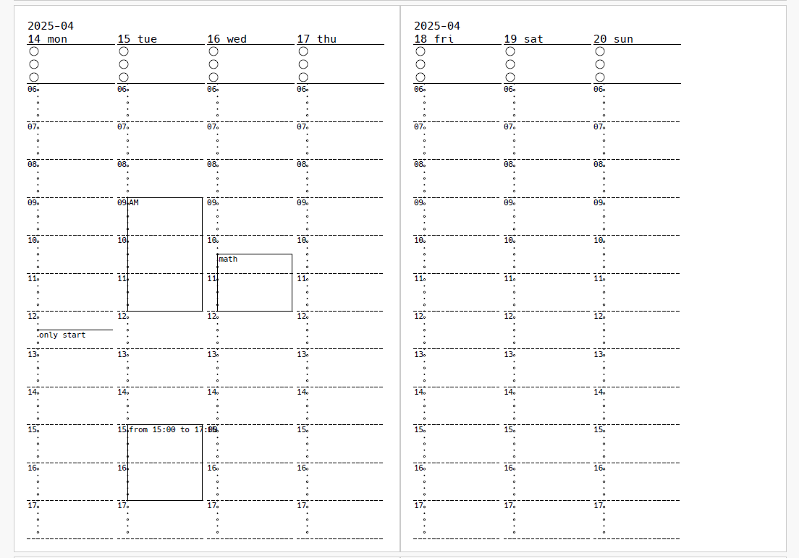

# vercal

vercal is Python code to create weekly verical calendar.  
You can use web version developed with streamlit and on your PC.  

vercalは，週間の縦型カレンダーを作成するPythonのコードです．
streamlitを使ったweb版もあります．
もちろん，コードをダウンロードすれば，自分のパソコンでも実行可能です．

## How to use on the web, web版の使い方

https://vercal.streamlit.app/

### basig settings 基本設定

set basic settings on the left sidebar.  

左側の項目を設定する．  



- Year，年  
- Starts with April: Start with April (checked), with January (unchecked)，4月始まり(チェック)，1月始まり(チェックなし)  
- Range in a day: Start and end hour of a day，1日の開始・終了時刻  
- Starts with Monday: Start with Monday (checked), with Sunday (unchecked)，月曜始まり(チェック)，日曜始まり(チェックなし)   
- Adujst left: Adjust left (checked), adjust right (unchecked)，1週間の左寄せ(checked), 右寄せ (unchecked)

To include repeated schedules in your calendar, upload excel file (see next section) with "Browse files".   
繰り返しの予定を入力するときは，次の項目のエクセルのファイルを用意して，「Browse files」からアップロードする．  

List of Schedules will be shown on the right.   
ファイルをアップロードすると，右側に予定の一覧が表示される. 



### Format of repeated schedule 繰り返しの予定の書式

Forma of Excel file  
エクセルファイルの書式  

| period_start | period_end | week_of_day | event_start | event_end | event          | except                 |
| ------------ | ---------- |  ---------- |  ---------- |  -------- |  ------------- |  --------------------- | 
| 2025-04-10   | 2025-07-10 | wed         | 10:30       |     12:00 | math           | 2025-05-07;2025-05-14  |
| 2025-04-10   | 2025-07-10 | mon         | 12:30       |     12:30 | only start     |                        |

- period_start: start date of an event  
- period_end  : end date of an event  
- week_of_day : week of day of an event   
- event_start : start time of an event  
- event_end   : end time of an event  
  No ending time, set the same as event_start  
- event       : event name  
- except      : date for exception  
  Separate with ";" for multiple date  

- period_start: 予定の開始年月日
- period_end  : 予定の終了年月日
- week_of_day : 予定の曜日  
- event_start : 予定の開始時刻  
- event_end   : 予定の終了時刻  
  終了時刻がない場合は，event_startと同じ時刻を入力  
- event       : 予定の内容  
- except      : 除外年月日  
  複数のときは，";"(半角のセミコロン)で区切る  

### Create calendar カレンダーの作成

左上の「Create calendar」をクリックすると，カレンダーの生成がはじまるので，暫く待つ．   
Click "Create calendar" to create calendar and wait for finish.  



カレンダーが生成されると，「DOWNLOAD CALENDER」と表示されるので，クリックする．   
After creating calendar, click "DOWNLOAD CALENDER".   

Created PDF file is as below.   
生成したPDFファイルは次のとおり．  




## Run with Phthon on your PC Pythonでの実行

```{python}
import os
import calendar
from datetime import datetime, timedelta
import pandas as pd

from reportlab.pdfbase import pdfmetrics
from reportlab.pdfbase.ttfonts import TTFont
from reportlab.pdfgen import canvas
from reportlab.lib.pagesizes import A5
from reportlab.lib.units import mm

import event
import vercal

# base settings
year            = 2025
hour_start      = 6     # start hour in a day
hour_end        = 22    # end hour in a day
starts_with_mon = True  # True: starts with Monday, False: with Sunday
adjust_left     = True  # True: adjust left, False: adjust right
font_path = './HackGen35Console-Regular.ttf' # not work in font directory

# event data
path = 'event.xlsx'
df_input = pd.read_excel(path)
df_date = event.generate_schedule(df_input)
df_event = event.format_events(df_date)

path_calendar = calendar_weekly_vertical(year, 
    font_path       = font_path, 
    hour_start      = hour_start, 
    hour_end        = hour_end,
    starts_with_mon = starts_with_mon, 
    adjust_left     = adjust_left, 
    df_event        = df_event)
```


## Citation 引用

松村 俊和 (2025) varcal: 縦型週間カレンダー作成ツール．<https://github.com/matutosi/vercal> .

Toshikazu Matsumura (2025) vercal: Tool for creating weekly vertical calender. <https://github.com/matutosi/vercal> .
